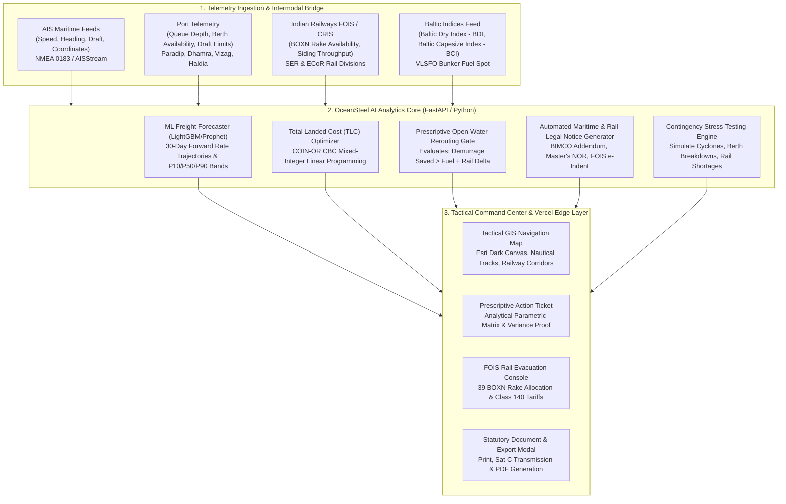

# OceanSteel AI ⚓ 🚂 🏭
### Autonomous Maritime-to-Inland Decision Support & Total Landed Cost (TLC) Optimizer for Raw Material Imports

[](https://www.sih.gov.in)
[](https://fastapi.tiangolo.com)
[](https://python.org)
[](https://vercel.com)
[](LICENSE)

---

## 📌 Problem Statement Metadata

* **Problem Statement ID:** `SIH262006`
* **Problem Statement Title:** *Model for Optimized Vessel Chartering and Bulk Cargo Procurement from overseas to East Coast of India*
* **Theme:** Logistics / Supply Chain / Smart Automation / Maritime & Railways
* **Category:** Software
* **Target Stakeholders:** Ministry of Steel, Steel Authority of India Ltd (SAIL), Rashtriya Ispat Nigam Ltd (RINL - Vizag Steel), Port Trusts (Paradip, Vizag, Kolkata/Haldia, Adani Ports Dhamra/Gangavaram), Indian Railways (CRIS / FOIS).

### 👥 Team Members
* **Sai**
* **Aryan Sirohi**
* **Adhithya Pandiri**
* **Shreeya C**
* **Hrishant Malviya**
* **Umair Shaikh**

---

## 📖 In-Depth Project Documentation (Index)

All foundational research, mathematical proofs, and slide deck transcriptions are documented inside the [`docs/`](docs/) directory:

1. **[SIH 2026 Complete Presentation Deck Breakdown](docs/PRESENTATION_DECK.md)** — Slide-by-slide transcription and deep dive of the 6 hackathon slides.
2. **[Mathematical Formulation & Optimization Model](docs/MATHEMATICAL_MODEL.md)** — Complete Linear Programming / MILP objective function, cost components, and constraints.
3. **[Statutory, Legal & Policy Precedents](docs/LEGAL_AND_POLICY_PRECEDENTS.md)** — Analysis of Calcutta High Court (*SAIL vs Vizag Seaport*, 2026), Supreme Court (2020) demurrage rulings, National Logistics Policy (NLP), and the National Steel Policy (300 MTPA).
4. **[System Architecture & Technical Specifications](docs/SYSTEM_ARCHITECTURE.md)** — Detailed API contracts, data flows, and intermodal telemetry specifications.

---

## 📌 Executive Overview & Core Problem Statement

* **Project:** **OceanSteel AI** — Autonomous Maritime-to-Inland Decision Support & Total Landed Cost (TLC) Optimizer
* **Problem:** Maritime shipping (AIS) and Indian Railways freight (FOIS/CRIS) operate in isolated operational silos. When bulk carriers arrive at congested East Coast ports (e.g., Paradip), vessels wait 7–10 days at outer anchorage, causing catastrophic charter demurrage fines ($20,000–$35,000/day in USD forex) and stockout risks for inland blast furnaces.
* **Solution:** India's first **Prescriptive Maritime-to-Inland Telemetry Decision Support System** that dynamically evaluates demurrage, marine bunker fuel, port tariffs, railway rake throughput, and plant stockpile runway to minimize the Total Landed Cost (TLC) of imported raw materials.
* **Core Differentiator:** **Descriptive Tracking $\rightarrow$ Prescriptive Autonomous Decision Support**. Descriptive tools merely display where a vessel is; OceanSteel AI calculates what the steel company must do next, validates legal/physical feasibility, and auto-generates statutory execution packages.

---

### 🧩 Core Modules & Architecture
1. **Tactical GIS Command Map:** High-resolution satellite/nautical visualization displaying live AIS vessel positions, anchorage waiting queues, navigation corridors, and inland railway sidings.
2. **Total Landed Cost (TLC) Optimizer:** Mixed-integer linear programming / dynamic cost engine balancing demurrage penalties, extra steaming fuel, handling charges, and railway freight (Class 140).
3. **Freight & Congestion Forecasting:** Forward trajectory modeling and queue depth predictive telemetry for East Coast hubs (Paradip, Dhamra, Haldia, Visakhapatnam).
4. **Legal & Railway Document Generation:** Instant 1-click issuance of BIMCO Charter Party Rerouting Addenda, Master's Notice of Readiness (NOR), Indian Railways FOIS Electronic Rake Indents (e-Indent), Cargo Evacuation Plans, and Financial Approval Sheets.

---

### 📥 Inputs & 📤 Outputs

| Category | Parameters & Telemetry Feeds |
| :--- | :--- |
| **System Inputs** | **Ship Profile:** Vessel class (Capesize), DWT, Current draft (17.5m), Speed (12.5 kn), Heading.<br>**Cargo:** Grade (Australian Hard Coking Coal), Volume (150,000 MT), Bill of Lading value.<br>**Port Telemetry:** Live anchorage queue depth (Paradip 7.8d vs Dhamra 1.1d), Berth draft limits (Haldia 8.5m limit vs 18.5m deepwater), Handling tariffs.<br>**Rail Capacity:** BOXN / BOXNHL rake availability (FOIS), Daily siding throughput, Siding clearance capacity.<br>**Inland Logistics:** Rail distance to plant (Dhamra-Rourkela 418km vs Paradip-Rourkela 462km), Class 140 freight tariff.<br>**Plant Runway:** Remaining raw material stockpile buffer (SAIL Rourkela 11-day critical threshold).<br>**Cost Drivers:** Charter demurrage rate ($25,000/day), VLSFO bunker fuel price ($650/MT), Port handling charges. |
| **System Outputs** | **Optimal Route Recommendation:** Ranked feasible port recommendation with physical constraint verification.<br>**Total Landed Cost (TLC):** Complete itemized cost breakdown per port.<br>**Financial Net Savings:** Clear delta calculation showing exact foreign exchange and rupee savings (**₹2.26 Crore / $272,068 USD**).<br>**Delivery Improvement:** Net turnaround acceleration (**8.3 days earlier delivery**, **6.7 days anchorage wait avoided**).<br>**Evacuation Allocation:** Railway wagon scheduling (**39 BOXN rakes** cleared in 3.9 days).<br>**Operational Execution Package:** 5 legally compliant, ready-to-issue maritime and railway operational documents. |

---

### 🏆 Benchmark Decision Case: MV Steel Horizon

* **Vessel & Cargo:** MV Steel Horizon — 150,000 MT Australian Premium Hard Coking Coal from Gladstone to **SAIL Rourkela Steel Plant (RSP)**.
* **Initial Status:** Nominated Port: Paradip | Anchorage Queue: 7.8 Days | Demurrage Liability: $195,000 USD.
* **Prescriptive Action:** **DIVERT TO DHAMRA PORT** (1.1 Days Queue, 18.5m Permissible Draft, 10 Rakes/Day FOIS Throughput).
* **Net Modeled Impact:**
  * 💰 **₹2.26 Crore ($272,068 USD)** net landed cost savings
  * ⏱️ **8.3 days earlier delivery** to SAIL Rourkela (safeguards 11-day plant stockpile runway)
  * ⚓ **6.7 days anchorage delay avoided**
  * 🚂 **39 BOXN rakes** safely dispatched via South Eastern Railway corridor



---

## 🧮 Mathematical Optimization Model

### 1. Dynamic Total Landed Cost (TLC) Equation
$$\min_{p \in \mathcal{P}_{\text{feasible}}} \text{TLC}(p) = C_{\text{ocean}} + C_{\text{bunker\_divert}}(p) + C_{\text{demurrage}}(p) + C_{\text{port\_handling}}(p) + C_{\text{rail\_freight}}(p) + C_{\text{storage\_fines}}(p)$$

**Subject to:**
1. **Draft Permissibility:** $\text{Draft}_{\text{vessel}} \le \text{MaxDraft}(p)$  
   *Ensures that a 17.5m draft Capesize vessel cannot dock at riverine ports like Haldia (max draft 8.5m).*
2. **Plant Stockout Buffer:** $\text{Delivery Date} \le \text{Remaining Stockpile Runway}$  
   *Guarantees that raw materials arrive before SAIL Rourkela's 11-day critical buffer is breached.*
3. **Railway Evacuation Capacity:** $\text{Evacuation Throughput} = \text{BOXN Rakes Available} \times 3,850\text{ MT/rake}$.  
   *If rakes are constrained and cargo cannot be evacuated within free port days, ground rent penalties are accrued.*

### 2. Prescriptive Open-Water Rerouting Gate (10–14 Days Out)
While the vessel is still in open water (Indian Ocean / Malacca Strait / Bay of Bengal), OceanSteel AI triggers an automated **"PRESCRIPTIVE DIVERT"** alert when:
$$\Delta \text{Demurrage Saved} > \Delta \text{Sea Bunker Fuel} + \Delta \text{Inland Rail Freight} + \Delta \text{Port Handling}$$

#### Real-World Operational Verification on MV Steel Horizon:
* **Cargo:** 150,000 MT Australian Premium Hard Coking Coal destined for **SAIL Rourkela Steel Plant (RSP)**.
* **Initial Nominated Port (Paradip):** 7.8 days queue $\rightarrow$ **$195,000 USD Demurrage Penalty**.
* **Recommended Optimal Port (Dhamra):** 1.1 days queue $\rightarrow$ **$27,500 USD Demurrage**.

| Parameter | Nominated (Paradip) | Recommended (Dhamra) | Variance / Delta |
| :--- | :--- | :--- | :--- |
| **Anchorage Wait Queue** | 7.8 Days | 1.1 Days | **-6.7 Days Avoided** |
| **Charter Demurrage Cost** | \$195,000 | \$27,500 | **-\$167,500 Saved** |
| **Extra Sea Bunker Fuel** | \$0 | +\$4,297 | +\$4,297 (0.18d steaming) |
| **Indian Railways Distance** | 462 km | 418 km | **-44 km Shorter Rail Haul** |
| **IR Freight Cost (Class 140)** | \$2,307,692 | \$2,181,490 | **-\$126,202 Saved on Rail** |
| **Port Handling & Dues** | \$630,000 | \$667,500 | +\$37,500 |
| **Total Landed Cost (TLC)** | **\$5,027,855** | **\$4,755,787** | **-\$272,068 USD (₹2.26 Cr)** |

**Bottom Line:** Net savings of **+$272,068 USD (₹2.26 Crore INR)** and **8.3 days earlier delivery** to SAIL Rourkela!

---

## 🚂 Indian Railways FOIS / CRIS Telemetry Integration

* **Standard Rakes:** 59-wagon **BOXN / BOXNHL** rake formations (~3,850 MT payload per train).
* **Rake Requirement:** Exactly **39 BOXN rakes** allocated to clear a 150,000 MT Capesize cargo.
* **Live Siding Availability & Throughput:**
  * **Dhamra Port Siding:** 10 BOXN rakes/day ready (38,500 MT/day throughput $\rightarrow$ clears cargo in 3.9 days).
  * **Paradip Port Siding:** 6 BOXN rakes/day ready.
  * **Visakhapatnam Siding:** 8 BOXN rakes/day ready.
* **Class 140 Bulk Tariff Savings:** Shorter rail distance from Dhamra to Rourkela (418 km vs 462 km) saves ₹70 per tonne, yielding **₹1.05 Crore ($126,202 USD) savings in railway freight alone**.
* **Automated Electronic Rake Indent (e-Indent):** Single-click generation of the official **CRIS FOIS Electronic Rake Requisition Indent** (`CRIS-FOIS-EIND-9481234`) with pre-allocated WAG-9 6000 HP electric locomotives.

---

## ⚖️ Legal & Statutory Precedents Citing

1. **Calcutta High Court Ruling (2026):**  
   *Steel Authority of India Ltd. (SAIL) vs. Vizag Seaport Private Ltd.*  
   Affirms the charterer's legal right under charter party liberties clauses (BIMCO GENCON / C(ORE)7) to re-nominate a discharge port to mitigate unreasonable berth detention.
2. **Supreme Court of India Landmark Ruling (2020):**  
   *Union of India & Anr. vs. Indian Inland Waterways & Ors.*  
   Enforces the commercial duty to mitigate maritime demurrage liabilities through advance intermodal coordination.
3. **Ministry of Ports, Shipping and Waterways (DGS Order):**  
   Demurrage waivers and inland evacuation coordination directives.
4. **National Logistics Policy (NLP) & National Steel Policy:**  
   Accelerates lowering logistics costs from 14% to single digits and enables India's **300 MTPA crude steel target**.

---

## 🚀 How to Run the Prototype

### Option 1: Full-Stack Local Server (FastAPI + Python 3.14)
1. Clone the repository:
   ```bash
   git clone https://github.com/adhithyapandiri-a11y/oceansteel-ai.git
   cd oceansteel-ai
   ```
2. Start the application:
   ```bash
   ./run_backend.sh
   # Or directly:
   # python3 -m uvicorn app.main:app --app-dir backend --host 0.0.0.0 --port 8000 --reload
   ```
3. Open **`http://localhost:8000`** in your browser.
4. OpenAPI / Swagger REST API docs: **`http://localhost:8000/docs`**.

### Option 2: Deploy to Vercel (1-Click)
This repository is pre-configured with `vercel.json` and serverless Python bindings (`api/index.py`):
1. Go to [vercel.com/new](https://vercel.com/new).
2. Import `adhithyapandiri-a11y/oceansteel-ai`.
3. Click **Deploy**. Vercel will build the serverless functions and serve the frontend on its global Edge CDN.

---

## 🎤 3-Minute Hackathon Pitch Script for Judges

* **Minute 1: The Problem & The Stakes**
  > *"Respected judges, Indian steel plants lose over ₹1.5 to ₹2 Crores in foreign exchange on every single Capesize shipment because vessels get stuck in 7-to-10-day outer anchorage queues at ports like Paradip. Ship tracking and Indian Railways operate in complete silos. We built OceanSteel AI to solve this."*

* **Minute 2: The Live Demonstration**
  > *"On our tactical GIS map, you can see MV Steel Horizon 11 days out in the Indian Ocean carrying 150,000 MT of Australian Coking Coal bound for SAIL Rourkela. Notice the red 7.8-day queue at Paradip.  
  > Watch what happens when we select 'Simulate Paradip Congestion': our mixed-integer linear programming solver checks vessel draft limits, extra sea steaming fuel, port discharge rates, and Indian Railways BOXN rake availability. In milliseconds, it issues our Prescriptive Rerouting Ticket: **Divert to Dhamra Port**.  
  > The financial proof shows: Demurrage saved (\$167,500) heavily exceeds the minor steaming fuel delta (\$4,297), generating a net cash saving of **\$272,068 (₹2.26 Crore)** and delivering raw materials **8.3 days earlier** before SAIL Rourkela's critical 11-day buffer runs out."*

* **Minute 3: 1-Click Operational Execution & Policy Impact**
  > *"Unlike descriptive tracking tools that only show where a ship is, OceanSteel AI executes the decision: with one click, it generates the official **BIMCO Charter Party Rerouting Order** citing Calcutta High Court precedent, the Master's **Notice of Readiness (NOR)**, and books 39 BOXN rakes on **Indian Railways FOIS**.  
  > This directly advances India's National Logistics Policy to bring logistics costs to single digits and preserves India's foreign exchange reserves!"*

---

## 🧪 Verification & Acceptance Test Sequence

### Automated Backend Tests
Run the unit test suite:
```bash
python3 -m unittest discover -s backend/tests -p "test_*.py"
```
**Results:** `5/5 tests passing in 0.126s`.

### 30-Step Interactive Judge Acceptance Flow
Follow this exact sequence to verify full end-to-end functionality:
1. **Launch App:** Open `index.html` in your browser (or run `./run_backend.sh` and navigate to `http://localhost:8000`).
2. **Verify Map:** Satellite GIS map loads with MV Steel Horizon, port beacons, and railway sidings.
3. **Click Vessel:** Click MV Steel Horizon on the map $\rightarrow$ Vessel Intelligence drawer opens with 150,000 MT coking coal and 17.5m draft.
4. **Simulate Congestion:** Click `[ ⚠️ Simulate Congestion ]` $\rightarrow$ Paradip queue jumps to 7.8 days with amber alert badge.
5. **Run Analysis:** Click `[ ⚡ Run OceanSteel Analysis ]` $\rightarrow$ 1.9s 7-step checklist animation executes.
6. **Constraint Validation:**
   - Haldia rejected: `❌ Draft Violation (Max 8.5m < 17.5m required)`.
   - Paradip penalized: `❌ Severe Congestion (7.8d queue, $195k demurrage)`.
   - Vizag sub-optimal: `⚠️ Higher Inland Rail Haul (810 km vs 418 km)`.
   - Dhamra selected: `✓ Optimal Multi-Modal Solution`.
7. **TLC Financial Proof:** Paradip TLC (\$5,027,855) vs Dhamra TLC (\$4,755,787) $\rightarrow$ Net savings: **₹2.26 Crore (\$272,068 USD)**.
8. **Delivery Speed:** 8.3 days earlier delivery & 6.7 days anchorage wait avoided.
9. **Rail Allocation:** 39 BOXN rakes scheduled via Indian Railways South Eastern Railway corridor.
10. **Explainability:** View the `🧠 OceanSteel Decision Engine` explainability breakdown showing all 4 port evaluations.
11. **Port Matrix:** Click `[ 📊 Compare All Ports ]` $\rightarrow$ full 8-column comparative matrix modal displays.
12. **Execution Package:** Click `[ 📄 Generate Execution Package ]` $\rightarrow$ 5 operational documents rendered (BIMCO Rerouting Addendum, CRIS FOIS e-Indent, Cargo Evacuation Plan, Master's NOR, Financial Approval Sheet).
13. **Human-in-the-Loop Approval:** Click `[ ✍️ Approve Diversion ]` $\rightarrow$ verification modal opens with sign-off details $\rightarrow$ click `[ Confirm & Issue Statutory Orders ]` $\rightarrow$ transition to `VOYAGE OPTIMIZED • EXECUTION READY`.
14. **One-Click Reset:** Click `[ 🔄 Reset Benchmark ]` $\rightarrow$ instantly returns all parameters and states to the clean initial demo state.

---

## 📄 License
This project is licensed under the MIT License - see the [LICENSE](LICENSE) file for details.
