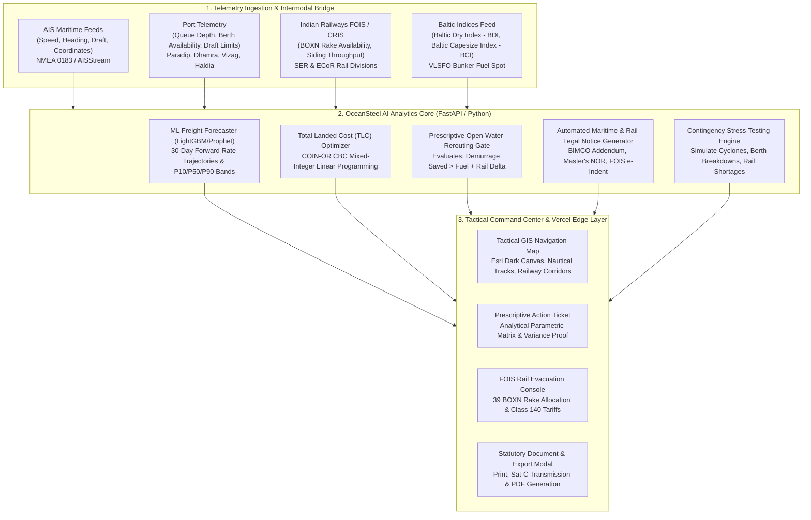

# OceanSteel AI: System Architecture & Technical Specifications

**Problem Statement ID:** `SIH262006`  
**System Architecture:** End-to-End Maritime-to-Inland Decision Support System

---

## 1. High-Level Architecture Diagram

---

## 2. Component Specifications

### 2.1 Backend Intelligence Core (FastAPI)
* **Framework:** FastAPI (ASGI Python 3.14) with Uvicorn server.
* **Optimization Engine:** PuLP with COIN-OR CBC MILP solver, with built-in analytical exact-minimum closed-form fallback for serverless container resilience.
* **Data Store:** In-memory high-speed state store representing live East Coast ports, active Capesize/Panamax vessels, and Indian Railways siding data.

### 2.2 REST API Endpoints
* `GET /api/health` — Health check, system version, and SIH metadata.
* `GET /api/summary` — Executive KPI aggregation (total Forex saved in USD and ₹ Crore, days saved, active vessels).
* `GET /api/vessels` — Live fleet list with real-time AIS positions and prescriptive evaluations.
* `GET /api/ports` — East Coast ports with queues, permissible drafts, and discharge capacities.
* `GET /api/plants` — Steel plants with daily burn rates and stockpile runway days.
* `GET /api/rail` — Indian Railways FOIS / CRIS siding telemetry and BOXN wagon readiness.
* `GET /api/forecast` — 30-day Baltic Dry Index (BDI) and Baltic Capesize Index (BCI) predictions with confidence intervals.
* `POST /api/optimize` — Executes Total Landed Cost (TLC) minimization for any vessel/plant pair.
* `POST /api/simulate` — Injects contingency scenarios (`paradip_congestion`, `cyclone_alert`, `rail_shortage`, `reset`).
* `POST /api/documents/generate` — Generates formatted BIMCO rerouting order, Pre-NOR, and FOIS e-indent.

### 2.3 Frontend Command Center
* **Map Layer:** Leaflet.js with Esri World Dark Gray Base (watermark-free), Esri World Imagery (Satellite), and OpenStreetMap.
* **Styling:** Tailwind CSS with an institutional dark slate palette (`#090d16` base, `#0f172a` panels).
* **Typography:** Inter for enterprise visual hierarchy and JetBrains Mono for tabular metrics.
* **Charts:** Chart.js for high-resolution time-series freight rate curves with confidence intervals.
* **Offline Fallback Engine (`fallback_data.js`):** Client-side seed ensures zero-blank-screen resilience on Vercel Edge CDN or offline hackathon pitches.
